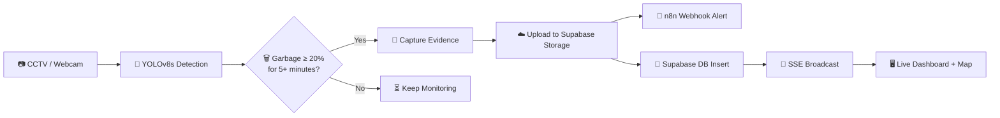

<div align="center">

<!-- Animated Header -->


<!-- Animated Badges -->
<p>
  
  
  
  
  
  
  
</p>

<p>
  
  
  
  
  
</p>

> *AI-powered garbage detection, severity scoring, and automated civic complaint workflow — with a real-time live dashboard, interactive map, and secure authentication.*

</div>

---

## 🌍 The Problem

Urban areas frequently suffer from **garbage overflow** because reporting is manual and inconsistent.

<table>
<tr>
<td>😶 Citizens ignore waste</td>
<td>🤷 Don't know where to report</td>
<td>😮‍💨 Filing complaints is tedious</td>
</tr>
</table>

This leads to **health hazards**, **poor sanitation**, and **environmental pollution**.

**CleanCam AI automates the entire reporting pipeline — from detection to complaint.**

---

## 💡 How It Works



---

## 🧠 Key Features

<table>
<tr>
<td align="center" width="20%">
  <h3>🗑️</h3>
  <b>Garbage Detection</b><br/>
  YOLOv8s model trained on 4730+ images with GPU acceleration
</td>
<td align="center" width="20%">
  <h3>📊</h3>
  <b>Severity Classification</b><br/>
  Auto-categorized: Low · Medium · High · Critical
</td>
<td align="center" width="20%">
  <h3>📡</h3>
  <b>Real-Time SSE</b><br/>
  Live dashboard updates via Server-Sent Events — no page refresh needed
</td>
<td align="center" width="20%">
  <h3>🗺️</h3>
  <b>Interactive Map</b><br/>
  Leaflet.js detection map with severity-colored markers and GPS tracking
</td>
<td align="center" width="20%">
  <h3>🔒</h3>
  <b>Secure Auth</b><br/>
  Supabase GoTrue login with HttpOnly session cookies
</td>
</tr>
<tr>
<td align="center" width="20%">
  <h3>☁️</h3>
  <b>Cloud Evidence</b><br/>
  In-memory JPEG upload directly to Supabase Storage
</td>
<td align="center" width="20%">
  <h3>📧</h3>
  <b>Auto Complaints</b><br/>
  Webhook alerts + email via n8n automation
</td>
<td align="center" width="20%">
  <h3>📱</h3>
  <b>PWA Ready</b><br/>
  Installable Progressive Web App with service worker caching
</td>
<td align="center" width="20%">
  <h3>🧪</h3>
  <b>Fully Tested</b><br/>
  35 automated unit & integration tests with pytest
</td>
<td align="center" width="20%">
  <h3>🌗</h3>
  <b>Dark/Light Mode</b><br/>
  Theme toggle with adaptive map tiles and UI styling
</td>
</tr>
</table>

---

## 📊 Model Performance

Trained on **RTX 4050 GPU** · **YOLOv8s** · **50 epochs** · **4730 images**

<table>
<tr>
<th>Metric</th>
<th>v1 (Nano, 10 epochs)</th>
<th>v2 (Small, 50 epochs)</th>
<th>Δ</th>
</tr>
<tr><td><b>Precision</b></td><td>0.679</td><td><b>0.731</b></td><td>✅ +7.7%</td></tr>
<tr><td><b>Recall</b></td><td>0.477</td><td><b>0.578</b></td><td>✅ +21.2%</td></tr>
<tr><td><b>mAP@50</b></td><td>0.547</td><td><b>0.650</b></td><td>✅ +18.8%</td></tr>
<tr><td><b>mAP@50-95</b></td><td>0.295</td><td><b>0.361</b></td><td>✅ +22.4%</td></tr>
<tr><td><b>Inference</b></td><td>49.4ms (CPU)</td><td><b>3.9ms (GPU)</b></td><td>⚡ 12.7x faster</td></tr>
</table>

---

## ⚙️ Tech Stack

<table>
<tr>
<td align="center"><br/><b>Python</b></td>
<td align="center"><br/><b>FastAPI</b></td>
<td align="center"><br/><b>Supabase</b></td>
<td align="center"><br/><b>PostgreSQL</b></td>
<td align="center"><br/><b>PyTorch</b></td>
<td align="center"><br/><b>Jinja2</b></td>
<td align="center"><br/><b>CSS</b></td>
<td align="center"><br/><b>Chart.js</b></td>
</tr>
</table>

| Layer | Technologies |
|-------|-------------|
| **Detection** | YOLOv8s · OpenCV · PyTorch (CUDA 12.8) |
| **Backend** | FastAPI · Uvicorn · Pydantic · SSE |
| **Database** | Supabase (PostgreSQL + Storage) |
| **Auth** | Supabase GoTrue · Session Cookies |
| **Automation** | n8n · Webhooks · Gmail |
| **Frontend** | Jinja2 · Chart.js · Leaflet.js · Dark/Light Mode |
| **Testing** | pytest · pytest-asyncio · httpx |
| **PWA** | Service Worker · Web App Manifest |

---

## 📁 Project Structure

```
CleanCam AI/
├── src/
│   ├── detect_severity.py          # Main detection engine (webcam → YOLO → Supabase)
│   ├── retrain.py                  # GPU training script (YOLOv8s, RTX 4050)
│   ├── supabase_client.py          # Shared Supabase connection
│   ├── tests/                      # Automated test suite
│   │   ├── test_severity.py        # 15 unit tests (severity scoring + models)
│   │   └── test_api.py             # 20 integration tests (routes + auth)
│   └── dashboard_api/
│       ├── main.py                 # FastAPI v4.0 (Auth + SSE + CORS)
│       ├── models/
│       │   └── complaint.py        # Pydantic data models
│       ├── services/
│       │   └── supabase_services.py
│       ├── templates/
│       │   ├── dashboard.html      # Dashboard UI (Chart.js + Leaflet + SSE)
│       │   └── login.html          # Glassmorphism login portal
│       └── static/
│           ├── manifest.json       # PWA manifest
│           ├── sw.js               # Service worker
│           ├── css/dashboard.css   # Dark theme + map styles
│           └── icons/              # PWA brand icons
├── model/
│   └── train_v2/weights/best.pt    # Trained YOLOv8s weights
├── .env                            # Configuration
├── requirements.txt
└── README.md
```

---

## 🚀 Quick Start

### 1️⃣ Clone & Setup

```bash
git clone https://github.com/rajmachawal-py/cleancam-ai.git
cd cleancam-ai
python -m venv venv
.\venv\Scripts\activate        # Windows
pip install -r requirements.txt
```

### 2️⃣ Configure `.env`

```env
MODEL_PATH = "path/to/model/train_v2/weights/best.pt"
CONF_THRESHOLD = 0.75
MIN_BOX_AREA = 500
SUPABASE_URL = "your-supabase-url"
SUPABASE_KEY = "your-supabase-anon-key"
N8N_WEBHOOK_URL = "your-n8n-webhook"
LOCATION = "Your Camera Location"
```

### 3️⃣ Run Detection

```bash
cd src
python detect_severity.py
# Press 'q' to quit, 'c' to force-trigger a complaint
```

### 4️⃣ Run Dashboard

```bash
cd src/dashboard_api
uvicorn main:app --reload
```

Open **http://127.0.0.1:8000/** → Login with your Supabase credentials 🔒

### 5️⃣ Run Tests

```bash
pytest src/tests/ -v
```

---

## 🎯 Use Cases

<table>
<tr>
<td align="center">🏙️<br/><b>Smart Cities</b></td>
<td align="center">🏢<br/><b>Municipal Corps</b></td>
<td align="center">🏘️<br/><b>Housing Societies</b></td>
<td align="center">🎓<br/><b>College Campuses</b></td>
<td align="center">🏭<br/><b>Industrial Areas</b></td>
</tr>
</table>

---

## 🔮 Roadmap

- [x] YOLOv8 garbage detection
- [x] Severity classification engine
- [x] n8n webhook automation
- [x] Supabase cloud migration (PostgreSQL + Storage)
- [x] Model retrain (YOLOv8s, 50 epochs, GPU)
- [x] Cloud-only evidence upload (in-memory)
- [x] Dashboard with Chart.js analytics
- [x] Dynamic browser GPS location config
- [x] SSE real-time live dashboard updates
- [x] Interactive Leaflet.js detection map
- [x] PWA support (installable, offline caching)
- [x] Supabase Auth (secure login/logout)
- [x] Automated test suite (35 tests)
- [x] Dark/Light mode with adaptive map tiles
- [ ] Multi-camera support
- [ ] Negative sample training (reduce false positives)
- [ ] Deployment to cloud

---

## 👨‍💻 Author

| Name | GitHub | LinkedIn |
|------|--------|----------|
| **Lakshay Vig** | [](https://github.com/rajmachawal-py) | [](https://linkedin.com/in/lakshay-vig/) |

---

## 🤝 Contributing

Contributions, issues, and feature requests are welcome!
Feel free to open a [pull request](https://github.com/rajmachawal-py/cleancam-ai/pulls).

---

<div align="center">

**If you found this useful, give it a ⭐**


</div>
