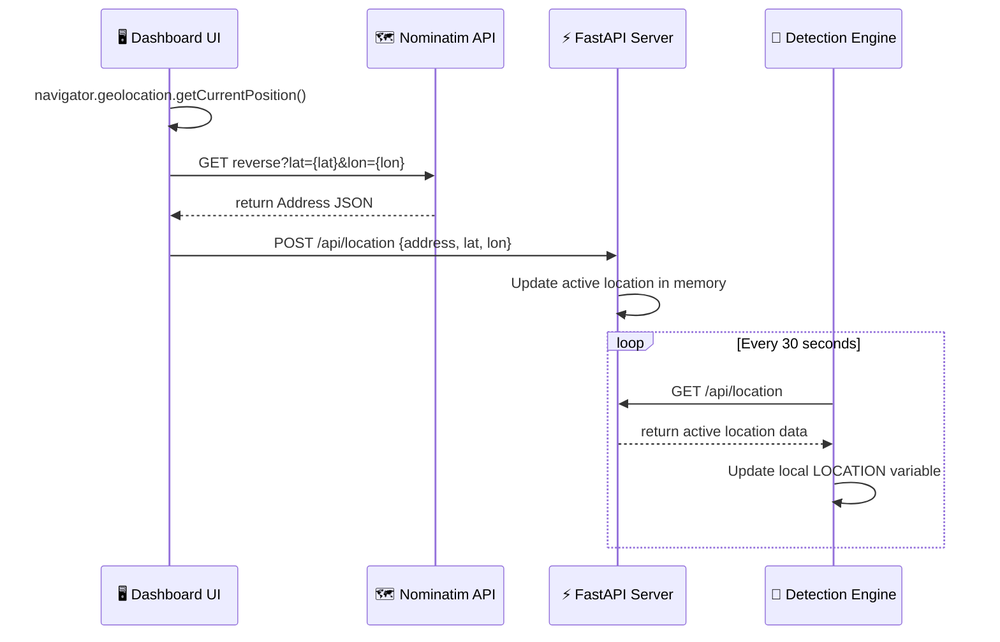

# CleanCam AI — Dynamic Browser Geolocation Plan

Currently, the camera location is hardcoded as the `LOCATION` variable in the `.env` file. This plan details a feature where the dashboard browser prompts the user for location access, reverse-geocodes the coordinates into a human-readable street address using OpenStreetMap (Nominatim), and updates the server. The detection engine then retrieves this live location dynamically.

## User Review Required

Please review the architectural flow and open questions below before approving.

> [!IMPORTANT]
> **Reverse Geocoding**: We are using OpenStreetMap's free **Nominatim API** client-side. It requires no API keys, which keeps the setup extremely simple. It does require an internet connection on the dashboard side to convert GPS coordinates to a street address.

---

## Open Questions

1. **Fallback Behavior**: If the FastAPI server is offline, or if the user denies browser location permissions, should the system fall back to the existing `.env` `LOCATION` value? (Proposed: **Yes**)
2. **Reverse Geocoding Format**: Nominatim returns detailed address components (road, suburb, city, postcode). Should we use the full `display_name` (e.g. *"123 Main St, Sector B, New York, 10001"*) or a simplified version? (Proposed: **Full display name** for maximum detail in filed complaints)

---

## Proposed Changes



### Backend — FastAPI Setup

#### [MODIFY] [main.py](file:///c:/Users/Lakshay/Desktop/Portfolio/CleanCam%20AI/src/dashboard_api/main.py)
- Define a Pydantic `LocationPayload` model:
  ```python
  class LocationPayload(BaseModel):
      address: str
      latitude: Optional[float] = None
      longitude: Optional[float] = None
  ```
- Store the active location in a global dictionary, initialized with the `.env` `LOCATION` value.
- Add `GET /api/location` which returns the current active location.
- Add `POST /api/location` which updates the active location and returns the new state.

---

### Frontend — Dashboard UI

#### [MODIFY] [dashboard.html](file:///c:/Users/Lakshay/Desktop/Portfolio/CleanCam%20AI/src/dashboard_api/templates/dashboard.html)
- Add a new "Location" indicator button in the header/hero section (with a 📍 icon) that shows the active location address.
- When clicked (or on initial load if location isn't set), run browser geolocation:
  ```javascript
  navigator.geolocation.getCurrentPosition(successCallback, errorCallback);
  ```
- In the success callback, fetch reverse geocoding data from OpenStreetMap:
  ```javascript
  fetch(`https://nominatim.openstreetmap.org/reverse?format=json&lat=${lat}&lon=${lon}`)
  ```
- Parse the address and POST it to `/api/location`.
- Update the UI element in real-time to show the fetched street address.

---

### Detection Engine — CLI Backend

#### [MODIFY] [detect_severity.py](file:///c:/Users/Lakshay/Desktop/Portfolio/CleanCam%20AI/src/detect_severity.py)
- Create a background thread or a periodic timer inside the main webcam loop that calls `GET http://127.0.0.1:8000/api/location` every 30 seconds.
- Update the global `LOCATION` variable in the script with the returned address.
- Wrap the API call in a `try/except` block to gracefully fall back to the `.env` `LOCATION` if the server is unreachable.

---

## Verification Plan

### Automated Tests
- None planned (Option 2 testing is not active).

### Manual Verification
1. Start FastAPI: `uvicorn main:app --reload`.
2. Open Dashboard `http://127.0.0.1:8000/dashboard` in browser.
3. Observe the browser location access prompt. Allow permission.
4. Verify that the address header updates from the fallback value to your actual physical address.
5. Start the detection engine: `python detect_severity.py`.
6. Press `c` to force-trigger a complaint.
7. Verify in Supabase DB / Email alerts that the logged location matches the browser's fetched street address.
