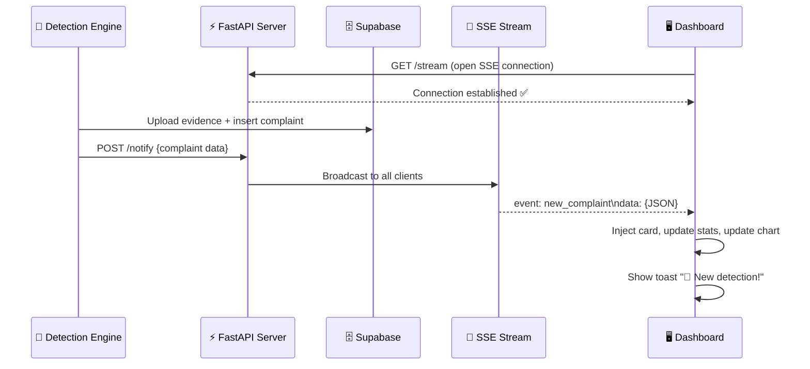

# Priority 5 — Real-Time Dashboard via Server-Sent Events (SSE)

Replace the current 30-second polling auto-refresh (which does a full `location.reload()`) with proper **Server-Sent Events** for instant, zero-reload updates when new garbage detections arrive.

---

## What Changes

| Current Behavior | After This Change |
|---|---|
| Dashboard polls `/complaints` every 30s | Dashboard opens persistent SSE connection |
| Full page reload when new data found | New cards animate in dynamically (no reload) |
| Stats are static (server-rendered) | Stats update live in real-time |
| Chart is static after page load | Chart adds new data points live |
| No feedback when detection arrives | Toast notification slides in |
| No connection status visibility | Live connection indicator (connected/reconnecting) |

---

## Proposed Changes

### Backend — FastAPI SSE + Notification

#### [MODIFY] [main.py](file:///c:/Users/Lakshay/Desktop/Portfolio/CleanCam%20AI/src/dashboard_api/main.py)

- Add `SSE /stream` endpoint using `StreamingResponse` with `text/event-stream` content type
- Use an `asyncio.Queue` per connected client, stored in a global set
- Add `POST /notify` endpoint that the detection engine calls after filing a complaint — this broadcasts the new complaint to all connected SSE clients
- Add CORS middleware so detection engine (running in a separate process) can POST to `/notify`
- Import `StreamingResponse`, `asyncio`, `json`

> [!NOTE]  
> **Why SSE over WebSocket?** SSE is simpler (one-way server→client), works over standard HTTP, auto-reconnects natively in browsers via `EventSource`, and is a perfect fit since the dashboard only *receives* updates. No need for bidirectional communication.

---

#### [MODIFY] [detect_severity.py](file:///c:/Users/Lakshay/Desktop/Portfolio/CleanCam%20AI/src/detect_severity.py)

- After `save_complaint_to_supabase()`, add a fire-and-forget HTTP POST to `http://127.0.0.1:8000/notify` with the new complaint data
- This triggers the SSE broadcast to all dashboard clients
- Wrapped in try/except so detection continues even if dashboard is offline

---

### Frontend — Live SSE Client + Dynamic UI Updates

#### [MODIFY] [dashboard.html](file:///c:/Users/Lakshay/Desktop/Portfolio/CleanCam%20AI/src/dashboard_api/templates/dashboard.html)

**SSE Connection:**
- Replace `initAutoRefresh()` (30s polling + reload) with `initSSE()` using `EventSource('/stream')`
- Handle `new_complaint` events → parse JSON payload
- Auto-reconnect is built into `EventSource`

**Dynamic Card Injection:**
- On receiving a new complaint, build a card HTML string (matching the existing Jinja2 card structure)
- Prepend it to `#reports-grid` with a highlight animation
- If the grid was showing the empty state, replace it with the new grid

**Stats Update:**
- Increment `#stat-total` counter
- Recalculate `#stat-avg` running average using the formula: `newAvg = (oldAvg × oldCount + newPct) / (oldCount + 1)`

**Chart Update:**
- If the new complaint's date matches the latest chart label, update existing bar/point
- Otherwise, add a new label + data point
- Call `chart.update()` to re-render

**Toast Notification:**
- Show a slide-in toast notification: "🚨 New [severity] detection — [garbage_pct]% at [location]"
- Auto-dismiss after 5 seconds with fade-out animation

**Connection Indicator:**
- Update the existing "Live" stat card to show connection status:
  - 🟢 `Connected` — SSE stream active
  - 🟡 `Reconnecting...` — SSE lost, auto-reconnecting
  - 🔴 `Disconnected` — SSE failed

---

#### [MODIFY] [dashboard.css](file:///c:/Users/Lakshay/Desktop/Portfolio/CleanCam%20AI/src/dashboard_api/static/css/dashboard.css)

- Add `.toast-notification` styles — fixed position bottom-right, glassmorphism background, slide-in from right
- Add `.card-new` highlight animation — brief green border glow that fades
- Add `.connection-status` indicator styles (green/yellow/red dot variants)
- Light mode overrides for toast and new card highlight

---

## Architecture Flow



---

## Verification Plan

### Manual Verification
1. Start the dashboard: `uvicorn main:app --reload`
2. Open `http://127.0.0.1:8000/dashboard` in browser
3. Open DevTools → Network tab → verify SSE connection under EventStream
4. Use `curl` to simulate a detection:
   ```bash
   curl -X POST http://127.0.0.1:8000/notify -H "Content-Type: application/json" -d "{\"id\": 999, \"timestamp\": \"2026-06-05T12:00:00\", \"location\": \"Test Street\", \"severity\": \"High\", \"garbage_pct\": 45.5, \"duration_seconds\": 350, \"evidence_url\": \"\"}"
   ```
5. Verify: new card appears with animation, stats update, chart updates, toast shows
6. Close/reopen browser tab → verify SSE reconnects automatically
7. Test with detection engine running → verify end-to-end flow
